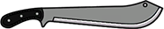
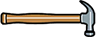
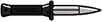
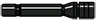

Weapons List
===============

This section contains a Impressive list of Weapon Names that you can use while creating your own Ammunition.

---------

.. contents:: Weapon Types:

----------

Meele
--------------

|image0|
**Name**: BaseBall Bat, 

**ID**: ``weapon_bat``

 
|image1|
**Name**: antique dagger, 

**ID**: ``weapon_dagger``

|image2|
**Name**: Broken Bottle, 

**ID**: ``weapon_bottle``

|image3|
**Name**: Fist, 

**ID**: ``weapon_unarmed``

|image4|
**Name**: Hatchet, 

**ID**: ``weapon_hatchet``

|image5|
**Name**: Crow Bar, 

**ID**: ``weapon_crowbar``

|image6|
**Name**: Knuckles, 

**ID**: ``weapon_knuckle``

|image7|
**Name**: Knife, 

**ID**: ``weapon_knife``

|image8|
**Name**: Machete, 

**ID**: ``weapon_machete``

|image9|
**Name**: Hammer, 

**ID**: ``weapon_hammer``

|image10|
**Name**: Golf Club Laps, 

**ID**: ``weapon_golfclub``

|image11|
**Name**: Switchblade, 

**ID**: ``weapon_switchblade``

|image12|
**Name**: Nightstick, 

**ID**: ``weapon_nightstick``

**Name**: pipewrench, 

**ID**: ``weapon_pipewrench``

**Name**: Battle Axe, 

**ID**: ``weapon_battleaxe``

|image13|
**Name**: Flashlight, **ID**: 

``weapon_flashlight``

