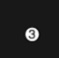

.. raw:: html

   <table>

.. raw:: html

   <tbody>

.. raw:: html

   <tr>

.. raw:: html

   <td style="text-align: center;">

|image0|
ID: 1, Name: Standard

.. raw:: html

   </td>

.. raw:: html

   <td style="text-align: center;">

|image1|
ID: 2, Name: BigBlip

.. raw:: html

   </td>

.. raw:: html

   <td style="text-align: center;">

|image2|
ID: 3, Name: PoliceOfficer

.. raw:: html

   </td>

.. raw:: html

   <td style="text-align: center;">

|image3|
ID: 4, Name: PoliceArea

.. raw:: html

   </td>

.. raw:: html

   <td style="text-align: center;">

|image4|
ID: 5, Name: Square

.. raw:: html

   </td>

.. raw:: html

   <td style="text-align: center;">

|image5|
ID: 6, Name: Player

.. raw:: html

   </td>

.. raw:: html

   <td style="text-align: center;">

|image6|
ID: 7, Name: North

.. raw:: html

   </td>

.. raw:: html

   <td style="text-align: center;">

|image7|
ID: 8, Name: Waypoint

.. raw:: html

   </td>

.. raw:: html

   <td style="text-align: center;">

|image8|
ID: 9, Name: BigCircle

.. raw:: html

   </td>

.. raw:: html

   <td style="text-align: center;">

|image9|
ID: 10, Name: BigCircleOutline

.. raw:: html

   </td>

.. raw:: html

   <td style="text-align: center;">

|image10|
ID: 11, Name: ArrowUpOutlined

.. raw:: html

   </td>

.. raw:: html

   <td style="text-align: center;">

|image11|
ID: 12, Name: ArrowDownOutlined

.. raw:: html

   </td>

.. raw:: html

   <td style="text-align: center;">

|image12|
ID: 13, Name: ArrowUp

.. raw:: html

   </td>

.. raw:: html

   <td style="text-align: center;">

|image13|
ID: 14, Name: ArrowDown

.. raw:: html

   </td>

.. raw:: html

   <td style="text-align: center;">

|image14|
ID: 15, Name: PoliceHelicopterAnimated

.. raw:: html

   </td>

.. raw:: html

   </tr>

.. raw:: html

   <tr>

.. raw:: html

   <td style="text-align: center;">

|image15|
ID: 16, Name: Jet

.. raw:: html

   </td>

.. raw:: html

   <td style="text-align: center;">

|image16|
ID: 17, Name: Number1

.. raw:: html

   </td>

.. raw:: html

   <td style="text-align: center;">

|image17|
ID: 18, Name: Number2

.. raw:: html

   </td>

.. raw:: html

   <td style="text-align: center;">

|image18|
ID: 19, Name: Number3

.. raw:: html

   </td>

.. raw:: html

   <td style="text-align: center;">

|image19|
ID: 20, Name: Number4

.. raw:: html

   </td>
   
   
   

.. |image1| image:: ./list_files/2_BlipSpriteBigBlip.png
.. |image2| image:: ./list_files/3_BlipSpritePoliceOfficer.png
   :width: 65px

.. |image4| image:: ./list_files/5_BlipSpriteSquare.png
   :width: 65px
.. |image5| image:: ./list_files/6_BlipSpritePlayer.png
.. |image6| image:: ./list_files/7_BlipSpriteNorth.png
.. |image7| image:: ./list_files/8_BlipSpriteWaypoint.png
.. |image8| image:: ./list_files/9_BlipSpriteBigCircle.png
   :width: 65px

.. |image10| image:: ./list_files/11_BlipSpriteArrowUpOutlined.png
.. |image11| image:: ./list_files/12_BlipSpriteArrowDownOutlined.png
.. |image12| image:: ./list_files/13_BlipSpriteArrowUp.png

.. |image14| image:: ./list_files/15_BlipSpritePoliceHelicopterAnimated.png
.. |image15| image:: ./list_files/16_BlipSpriteJet.png

.. |image17| image:: ./list_files/18_BlipSpriteNumber2.png

.. |image19| image:: ./list_files/20_BlipSpriteNumber4.png